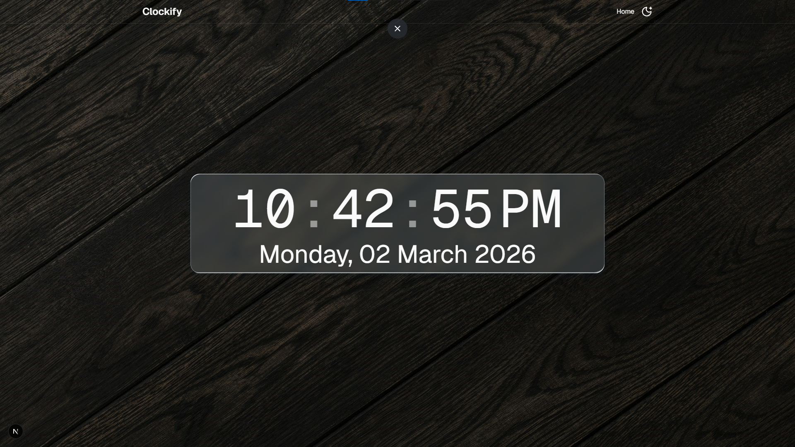

<div align="center">

# Clockify

A modern, real-time digital clock built with **Next.js**, **React 19**, and **Motion**. Features smooth animated number transitions, dark/light theme support, and a sleek glassmorphism UI.

Built by [Piyush Sarkar](https://github.com/piyushsarkar-dev)

<picture>
  <source media="(prefers-color-scheme: dark)" srcset="public/readme-dark-bg.png">
  <source media="(prefers-color-scheme: light)" srcset="public/readme-light-bg.png">
  
</picture>

</div>

---

## Features

- **Real-Time Clock** — Live hours, minutes, and seconds updated every second via `useEffect`
- **Animated Sliding Numbers** — Smooth digit transitions powered by [Motion](https://motion.dev) primitives
- **Dark & Light Themes** — Toggle seamlessly with `next-themes`, complete with themed background images
- **Glassmorphism UI** — Frosted-glass card with layered inset shadows and backdrop blur
- **Responsive Design** — Built with Tailwind CSS v4 for a fluid layout across screen sizes
- **Date Display** — Full formatted date shown beneath the clock (e.g., _Monday, 02 March 2026_)

## Tech Stack

| Category       | Technology                                                |
| -------------- | --------------------------------------------------------- |
| Framework      | [Next.js 16](https://nextjs.org/) (App Router)            |
| Language       | [TypeScript 5](https://www.typescriptlang.org/)           |
| UI / Styling   | [Tailwind CSS 4](https://tailwindcss.com/), shadcn/ui     |
| Animation      | [Motion](https://motion.dev/)                             |
| Theming        | [next-themes](https://github.com/pacocoursey/next-themes) |
| Date Utilities | [date-fns](https://date-fns.org/)                         |
| Icons          | [Lucide React](https://lucide.dev/)                       |
| Runtime        | Node ≥ 22, Bun / npm ≥ 11                                 |

## Getting Started

### Prerequisites

- **Node.js** 22 or later
- **Bun** (recommended) or **npm** 11+

### Installation

```bash
# Clone the repository
git clone https://github.com/piyushsarkar-dev/clockify.git
cd clockify

# Install dependencies
bun install
# or
npm install
```

### Development

```bash
bun dev
# or
npm run dev
```

Open [http://localhost:3000](http://localhost:3000) in your browser.

### Production Build

```bash
# Lint, build, and start
bun run prod
# or
npm run prod
```

## Project Structure

```
clockify/
├── public/                  # Static assets (backgrounds, favicon)
├── components/
│   └── motion-primitives/   # Animated sliding number component
├── src/
│   ├── app/                 # Next.js App Router (layout, page, styles)
│   ├── components/
│   │   ├── Clock.tsx        # Main clock component
│   │   ├── ThemeToggleButton.tsx
│   │   ├── Header/          # Site header with navigation
│   │   ├── Providers/       # Theme provider wrapper
│   │   └── shadcnui/        # shadcn/ui components
│   ├── hooks/               # Custom React hooks
│   └── lib/                 # Utilities and font configuration
├── package.json
└── tsconfig.json
```

## Contributing

Contributions are welcome! To get started:

1. **Fork** the repository
2. **Create** a feature branch: `git checkout -b feat/your-feature`
3. **Commit** your changes: `git commit -m "feat: add your feature"`
4. **Push** to the branch: `git push origin feat/your-feature`
5. **Open** a Pull Request

Please make sure your code passes linting (`bun run lint`) before submitting.

## License

This project is licensed under the **MIT License** — see the [LICENSE](LICENSE) file for details.

Copyright &copy; 2026 Piyush Sarkar
