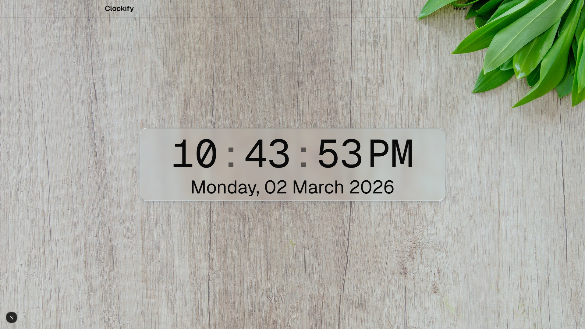

<div align="center">

# ⏰ Clockify

### A beautifully crafted real-time digital clock with smooth animations and a stunning glassmorphism UI.

[](https://nextjs.org/)
[](https://react.dev/)
[](https://www.typescriptlang.org/)
[](https://tailwindcss.com/)
[](LICENSE)

<br />

Built with passion by [**Piyush Sarkar**](https://github.com/piyushsarkar-dev)

<br />

### 🌞 Light Mode



<br />

### 🌙 Dark Mode


</div>

<br />

---

## ✨ Features

| Feature                     | Description                                                                          |
| :-------------------------- | :----------------------------------------------------------------------------------- |
| **Real-Time Clock**         | Hours, minutes, and seconds update every second — always accurate, always alive.     |
| **Animated Sliding Digits** | Silky-smooth number transitions powered by [Motion](https://motion.dev) primitives.  |
| **Dark & Light Themes**     | One-click toggle between themes via `next-themes`, with matching background imagery. |
| **Glassmorphism UI**        | A frosted-glass card with layered inset shadows, backdrop blur, and subtle depth.    |
| **Responsive Layout**       | Fluid design built with Tailwind CSS v4 — looks great on every screen size.          |
| **Live Date Display**       | Full formatted date rendered beneath the clock (e.g., _Monday, 02 March 2026_).      |

---

## 🛠️ Tech Stack

| Category           | Technology                                                                       |
| :----------------- | :------------------------------------------------------------------------------- |
| **Framework**      | [Next.js 16](https://nextjs.org/) — App Router                                   |
| **Language**       | [TypeScript 5](https://www.typescriptlang.org/)                                  |
| **UI & Styling**   | [Tailwind CSS 4](https://tailwindcss.com/) + [shadcn/ui](https://ui.shadcn.com/) |
| **Animation**      | [Motion](https://motion.dev/)                                                    |
| **Theming**        | [next-themes](https://github.com/pacocoursey/next-themes)                        |
| **Date Utilities** | [date-fns](https://date-fns.org/)                                                |
| **Icons**          | [Lucide React](https://lucide.dev/)                                              |
| **Runtime**        | Node ≥ 22, Bun / npm ≥ 11                                                        |

---

## 📊 Project Stats

<div align="center">

|         Metric          |              Value               |
| :---------------------: | :------------------------------: |
|    **Dependencies**     |                12                |
|  **Dev Dependencies**   |                11                |
|     **Components**      |                6+                |
|    **Theme Support**    |           Dark & Light           |
|  **Animation Engine**   | Motion (Framer Motion successor) |
| **Bundle Optimization** |      React Compiler + Sharp      |

</div>

---

## 🚀 Getting Started

### Prerequisites

- **Node.js** 22 or later
- **Bun** (recommended) or **npm** 11+

### Installation

```bash
# Clone the repository
git clone https://github.com/piyushsarkar-dev/clockify.git
cd clockify

# Install dependencies (pick one)
bun install
# or
npm install
```

### Development

```bash
bun dev
# or
npm run dev
```

Then open [**http://localhost:3000**](http://localhost:3000) in your browser.

### Production Build

```bash
bun run prod
# or
npm run prod
```

---

## 📂 Project Structure

```
clockify/
├── public/                    # Static assets (backgrounds, favicon)
├── components/
│   └── motion-primitives/     # Animated sliding number component
├── src/
│   ├── app/                   # Next.js App Router (layout, page, global styles)
│   ├── components/
│   │   ├── Clock.tsx          # Core clock logic — time, date, sliding digits
│   │   ├── ThemeToggleButton.tsx  # Sun/Moon toggle for dark & light themes
│   │   ├── Header/            # Site header with navigation
│   │   ├── Providers/         # Theme provider wrapper
│   │   └── shadcnui/          # shadcn/ui primitives
│   ├── hooks/                 # Custom React hooks
│   └── lib/                   # Utilities & font configuration
├── package.json
└── tsconfig.json
```

---

## 🤝 Contributing

Contributions, issues, and feature requests are always welcome!

1. **Fork** this repository
2. **Create** your feature branch — `git checkout -b feat/amazing-feature`
3. **Commit** your changes — `git commit -m "feat: add amazing feature"`
4. **Push** to the branch — `git push origin feat/amazing-feature`
5. **Open** a Pull Request

> Make sure your code passes linting before submitting: `bun run lint`

---

## 📄 License

This project is licensed under the **MIT License** — see the [LICENSE](LICENSE) file for details.

Copyright &copy; 2026 [Piyush Sarkar](https://github.com/piyushsarkar-dev)

---

<div align="center">

**If you found this project useful, consider giving it a ⭐**

</div>
